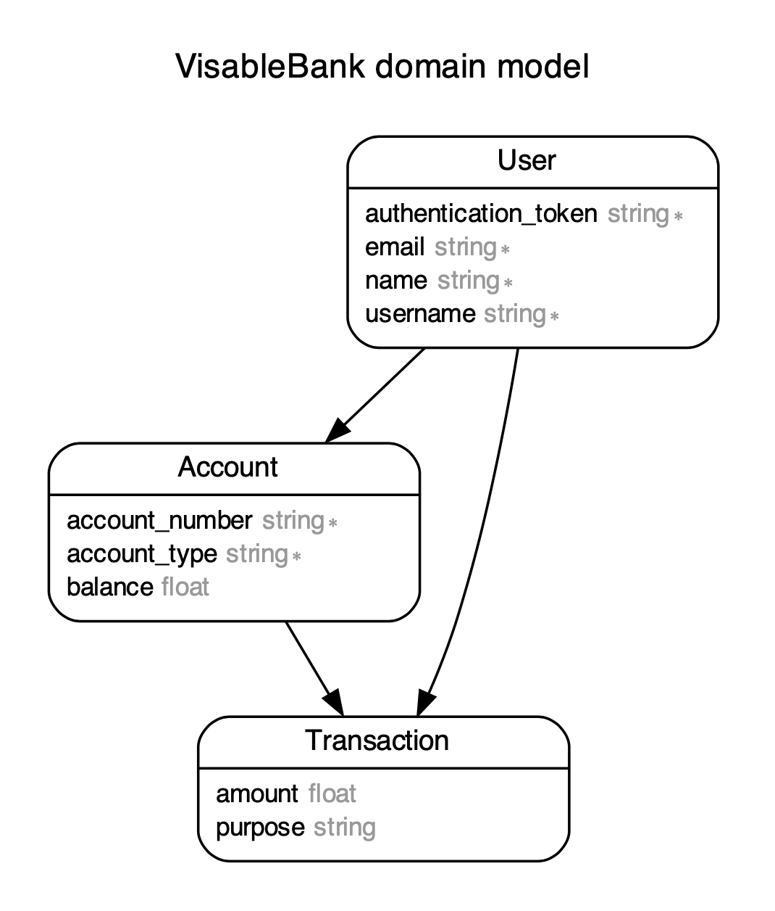
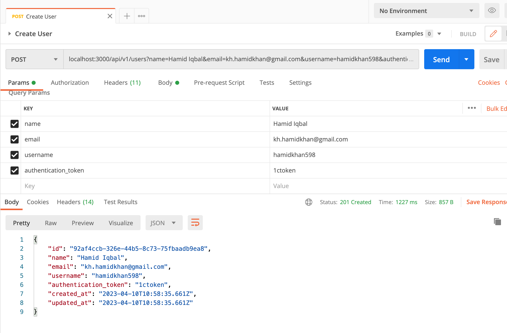
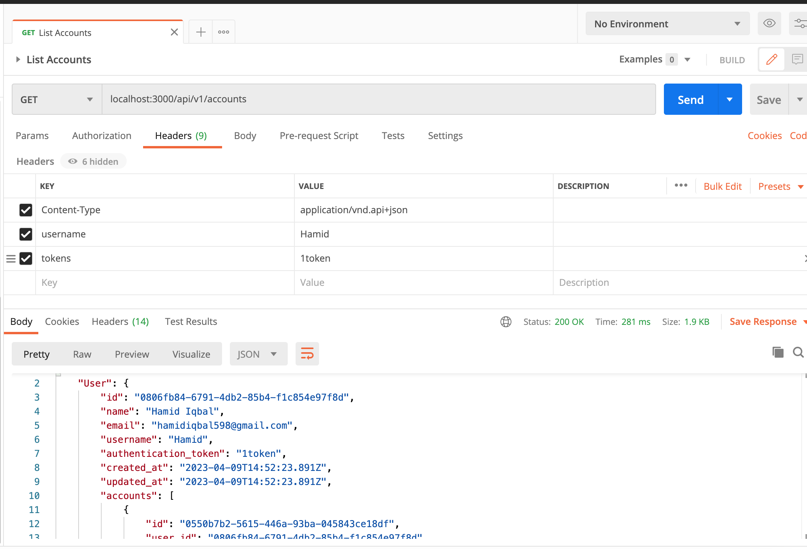
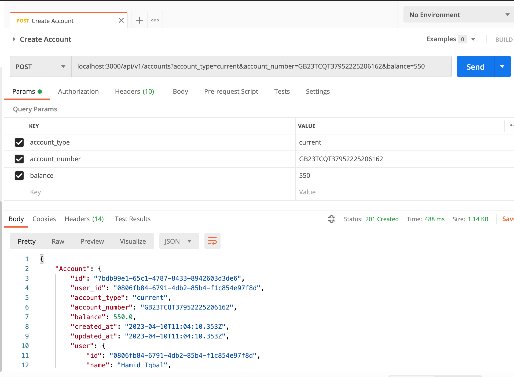
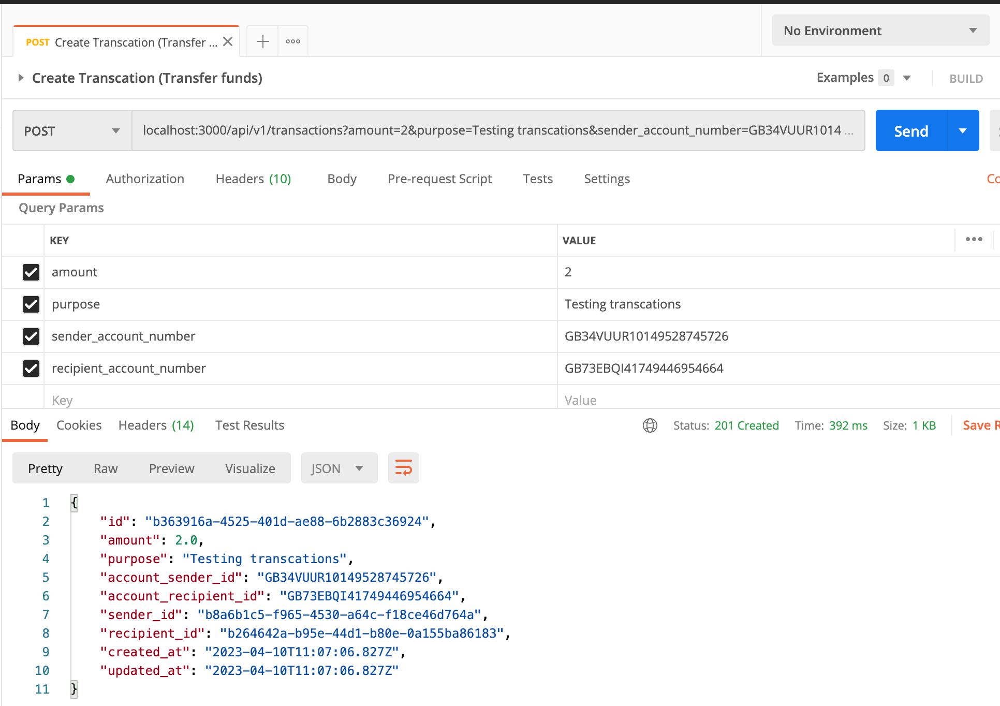
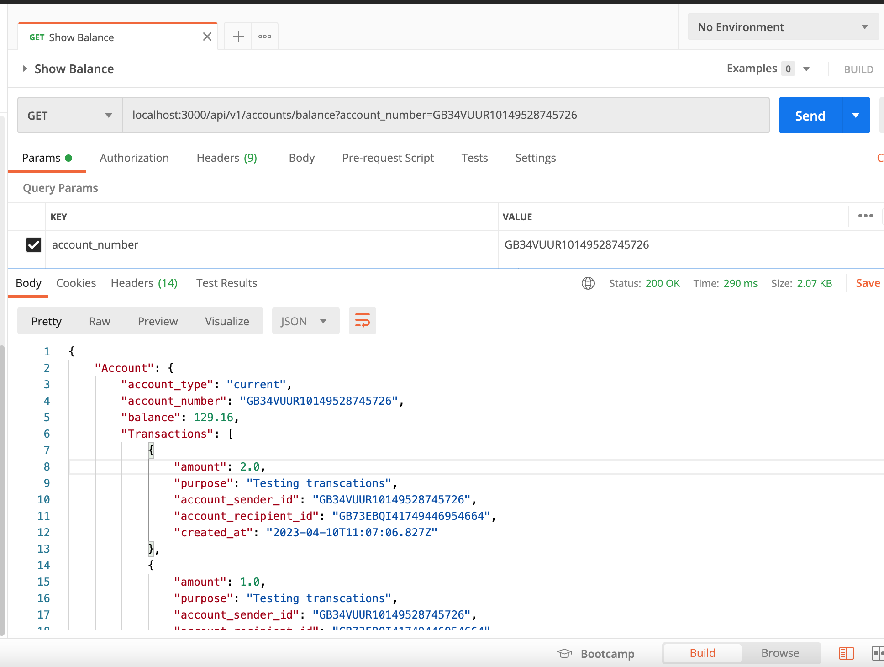
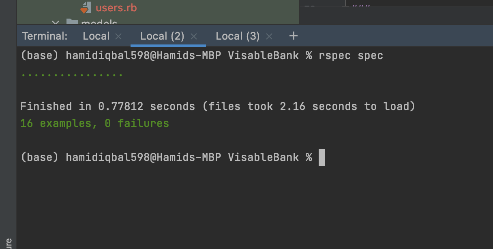

# Learning Assessment
## Visable Bank
### Project Requirements are in VisableBank.png


The aim is to express my level of skills and knowledge as they are required to deal with everyday tasks.
To achieve this purpose, I completed all tasks while keeping in mind the task definition.

Solution:
* I used Ruby on Rails Framework for Development.
* Ruby (Version: 3.2.2)
    * CMD (bundle install)
* Rails (Version: 7.0.4)
* Database - PostgreSQL
* Database creation
* Database initialization
    * CMD (rake db:setup)
    * I added initial records in db:seed

* For Test Cases I used (Rspec)
* How to run the test suite
    * CMD (bundle exec rspec spec)

* Running instructions:
    * CMD (rails s)
      Heroku-Server Link: https://dry-citadel-31354.herokuapp.com
    * View on any API Testing Platform (eg: POSTMAN)
    * Collection Link ( https://api.postman.com/collections/8662553-64387f6a-c43a-487f-b07e-7d1fd82350bd?access_key=PMAT-01GXNG126ZK6WF5AF19GVF8KQ4 )

# Run the Rails Application using Docker

host: localhost -> host: database

##### First need to Uncomment 3 lines in database.yml
##### Which includes host, username, and password.
##### Then run these commands:

```
docker compose build
docker-compose run web rake db:create
docker-compose run --rm web bundle exec rake db:migrate
docker-compose run --rm web bundle exec rake db:seed
docker compose up
```
*PS: If you're using MAC then it cause an issue in "apt-get update" cmd in Docker, the solution to this problem is going to "Screen Time" setting and change the settings to "Unrestricted web access".

## Overview

Here Rails applications has three models according to the following database scheme.
* User where we can save the detail of username and authentication_token.
* Account which carry the detail of account like balance and account_type.
* Transaction which carry the user who posted any transaction on a specific account and transfer funds to different account either it's own or someone's else account.
* Relations between these models are like: User has_many Accounts, Accounts has_many Transactions as show in below ERD.




There is a Api Controllers having All the implementations.
## Technical Details
### API Requests


1. `POST /users` Create a New User
   ```
   POST: localhost:3000/api/v1/users
   Server-Link: https://dry-citadel-31354.herokuapp.com/api/v1/users
   Headers: { 'Content-Type' => 'application/vnd.api+json', 'username' => 'Hamid', 'tokens' => '1token' }
   Params: { 'name' => 'Hamid Iqbal', 'email' => 'kh.hamidkhan@gmail.com', 'username' => 'hamidkhan598', 'authentication_token' => '1ctoken' }
    ```
   

2. `GET /accounts` Listed all Accounts.
   ```
   GET: localhost:3000/api/v1/accounts
   Server-Link: https://dry-citadel-31354.herokuapp.com/api/v1/accounts
   Headers: { 'Content-Type' => 'application/vnd.api+json', 'username' => 'Hamid', 'tokens' => '1token' }
    ```
   
   
3. `POST /accounts` Create new Account for specific user
   ```
   POST: localhost:3000/api/v1/accounts
   Server-Link: https://dry-citadel-31354.herokuapp.com/api/v1/accounts
   Headers: { 'Content-Type' => 'application/vnd.api+json', 'username' => 'Hamid', 'tokens' => '1token' }
   Params: { 'account_type' => 'current', 'account_number' => 'GB23TCQT37952225206162', 'balance' => '55' }
    ```
   

4. `POST /transactions` Create new Transaction for specific user
   ```
   POST: localhost:3000/api/v1/transactions
   Server-Link: https://dry-citadel-31354.herokuapp.com/api/v1/transactions
   Headers: { 'Content-Type' => 'application/vnd.api+json', 'username' => 'Hamid', 'tokens' => '1token' }
   Params: { 'amount' => '2', 'purpose' => 'Testing transcations', 'sender_account_number' => 'GB34VUUR10149528745726', 'recipient_account_number' => 'GB73EBQI41749446954664' }
    ```
   
   
3. `GET /accounts/balance`
   ```
   GET: localhost:3000/api/v1/accounts/balance
   Server-Link: https://dry-citadel-31354.herokuapp.com/api/v1/accounts/balance
   Headers: { 'Content-Type' => 'application/vnd.api+json', 'username' => 'Hamid', 'tokens' => '3btoken' }
   Params: { 'account_number' => 'GB34VUUR10149528745726' }
    ```
   
   
For Further Understanding, I also attach POSTMAN Collection link above.


#### Other major topics to Cover

    - Needed columns are with complete validations required
    - Created a service which is used to create a Transaction.
    - Resole the N+1 queries in the project controller.
    - Moreover upload the project to server on Heroku and can hit the api with server link
    - Try to make the things as easy as much as friendly but still alot of things to improve as time is short like <3hr.


### IN Total 16 Test Cases are implemented.

    - For Unit Test Cases I used Rspec Library.
    - With Docker CMD: docker-compose run --rm web bundle exec rspec spec
    - Without Docker Command: bundle exec rspec spec




## That's ALL, Folks!

###

##### *** In case something isn't clear or any issue while setup, feel free to contact me. Email Address: hamidiqbal598@gmail.com

## GOOD BYE